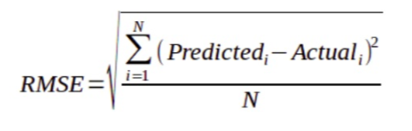

# Power-Plant-Energy-Output-Prediction-
It was my first attempt to participate in an ALL India based Hackathon. 
The dataset was collected from a Combined Cycle Power Plant over 6 years (2006-2011) when the power plant was set to work with a full load. Features consist of hourly average ambient variables Temperature (T), Ambient Pressure (AP), Relative Humidity (RH), and Exhaust Vacuum (V) to predict the net hourly electrical energy output (PE) of the plant.
# Attribute Information:
Features consist of hourly average ambient variables

- Temperature (T) in the range 1.81°C and 37.11°C
- Ambient Pressure (AP) in the range 992.89-1033.30 millibar
- Relative Humidity (RH) in the range of 25.56% to 100.16%
- Exhaust Vacuum (V) in the range 25.36-81.56 cm Hg
- Net hourly electrical energy output (PE) 420.26-495.76 MW

The averages are taken from various sensors located around the plant that record the ambient variables every second. The variables are given without normalization.
# Evaluation
The evaluation was on basis of the final **RMSE** score

# Result
The machine learning model gives a final score of **2.2722068544013796**
